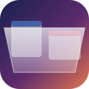
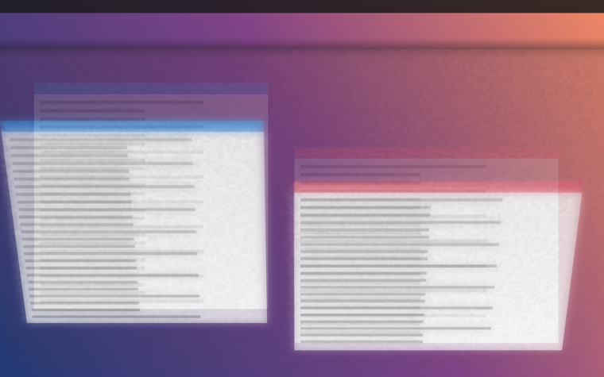
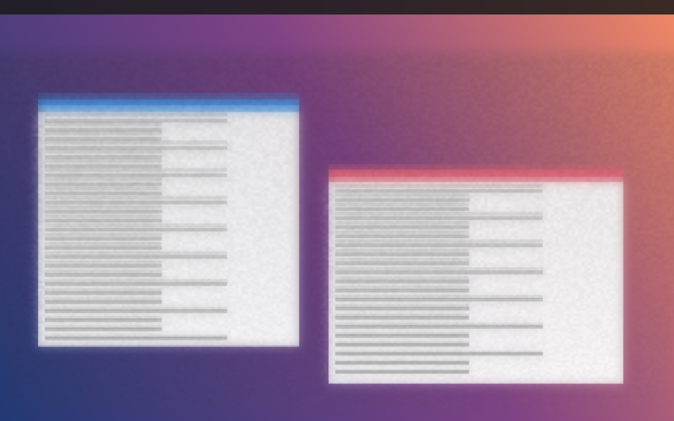

<div align="center">



# FrostFold

**A pane of frosted glass, hinged along the bottom edge of your MacBook's display.**

It reads the lid-angle sensor directly. Close the lid slowly and the glass leans with it.<br>
Stop halfway and it holds there.

<p>
  
  
  
  
  
</p>


<sub>Stills are rendered from a synthetic desktop so none of mine ends up in the repo.<br>
Regenerate them from your own screenshot: <code>Scripts/filmstrip.sh --input shot.png --out docs/images</code></sub>

</div>

---

FrostFold is a cosmetic effect and nothing else. Menu-bar app, no dock icon, no
account, no licence key, no network code of any kind.

## The fold

The pane lies flat and invisible while the lid is open. As the lid comes down it
lifts, leans and foreshortens — driven by the sensor, not by a timed animation.

<table>
<tr>
<td width="33%"></td>
<td width="33%"></td>
<td width="33%"></td>
</tr>
<tr>
<td align="center"><strong>125°</strong><br><sub>at rest — nothing renders,<br>capture is off</sub></td>
<td align="center"><strong>70°</strong><br><sub>lifting</sub></td>
<td align="center"><strong>22°</strong><br><sub>nearly shut</sub></td>
</tr>
</table>

### Two kinds of glass

<table>
<tr>
<td width="50%"></td>
<td width="50%"></td>
</tr>
<tr>
<td align="center"><strong>Lift the image</strong><br><sub>the pane carries a copy of the display,<br>so the picture lifts and leans with the glass</sub></td>
<td align="center"><strong>See through</strong><br><sub>the pane is empty glass — you see the real<br>display through it, blurred and refracted</sub></td>
</tr>
</table>

## Requirements

| | |
|---|---|
| **OS** | macOS 14 Sonoma or later |
| **Hardware** | A MacBook with a **continuous lid-angle sensor**. Apple silicon Airs (M2 and later) and 14"/16" Pros have one; the M1 Air, the 13" M1 Pro and every desktop Mac do not. |
| **Toolchain** | Xcode Command Line Tools (`xcode-select --install`). Full Xcode is **not** required — the Metal shaders are compiled at runtime. |

Not sure whether your Mac qualifies? Build it and run `--selftest`; it tells you
in one line.

## Install

```sh
Scripts/bundle.sh              # native slice, for iterating
Scripts/bundle.sh --universal  # arm64 + x86_64, for releases
open dist/FrostFold.app
```

That compiles a release build, assembles `dist/FrostFold.app` and ad-hoc signs
it. Use `--universal` for anything you publish: the 2019-and-later Intel 16"
MacBook Pros have the sensor too.

> [!NOTE]
> The ad-hoc signature is not cosmetic. macOS remembers the Screen Recording
> grant against the bundle's identity, and an unsigned bundle loses the
> permission on every rebuild.

## Permission

FrostFold needs **Screen Recording**, and it is not optional — the glass is
built out of your live display, so there is nothing to render without it.

On first launch macOS will ask. Grant it under Privacy & Security → Screen
Recording, then launch the app again (macOS requires the relaunch).

The lid-angle sensor itself needs no permission at all.

## Settings

Open them from the menu-bar item. **Preview…** opens a window with a manual
scrubber, so you can dial the effect in without opening and closing the lid a
hundred times.

**Material**

| | |
|---|---|
| **Intensity** | Low / Medium / High. Drives how far the glass scatters and how opaque it sits. |
| **Glass** | *Lift the image* or *See through* — the two modes shown above. |
| **Perspective** | How strongly the pane foreshortens as it leans toward you. |
| **Edge softness** | Feathering where the glass meets the display. |
| **Corner radius** | Rounding of the pane's corners. |

**Motion**

| | |
|---|---|
| **Responsiveness** | Low trails the lid; high tracks it immediately. |
| **Hinge sensitivity** | Where in the lid's travel the fold does most of its work. |
| **Minimum movement** | Deadband, in degrees. Below this the pane holds still, so a lid parked part-way open doesn't shimmer on sensor noise. |
| **Resting angle** | The lid angle at which the pane lies flat and disappears. Above it, nothing renders and capture is off. |
| **Maximum fold** | How far the pane tilts as the lid approaches shut. |
| **Stationary frame rate** | 15 / 30 / 60 / 90 / 120 FPS. Only applies while the lid is still. |

## How it works

**The sensor.** MacBooks expose the hinge as an Apple HID sensor device (`las`,
usage page `0x20`, usage `0x8A`). Two feature reports carry the angle: report 7
is a little-endian `UInt32` in hundredths of a degree, report 1 a `UInt16` in
whole degrees. FrostFold prefers 7 and falls back to 1. It polls at 120 Hz while
the lid is moving and drops to the stationary rate once it settles.

**The capture.** A ScreenCaptureKit stream over the built-in display, with
FrostFold's own windows excluded from the content filter (and marked
`sharingType = .none`) so the pane cannot capture its own output and spiral.
Frames arrive as `IOSurface`-backed pixel buffers and become Metal textures
without a copy.

**The render.** The pane is a real quad in 3D, hinged along `y = -1` and rotated
about that edge. The vertex shader hands the rasteriser a `w` of `(D - z) / D`
and lets the hardware do the perspective divide, so the texture stays correct
across the whole pane rather than warping the way a 2D fake does. The fragment
shader reduces the frame to quarter resolution, runs a separable Gaussian over
it, and mixes that diffuse lobe against the sharp frame by an amount that grows
with distance from the hinge — glass standing further off the display scatters
more. Grain is keyed to pane-local coordinates, so it lives in the material and
travels with it instead of sitting on the display behind.

There is no specular term anywhere in the shader. Etched glass scatters light;
it does not reflect it.

## Battery

Capture runs only while the pane has something to show. Above the resting angle
the stream is torn down entirely and the overlay clears to fully transparent —
what is left is a feature-report read at the stationary rate, which is a few
dozen bytes over the HID transport.

## Privacy

Captured frames go from ScreenCaptureKit to the GPU and nowhere else. Nothing is
written to disk, nothing is sent anywhere, there is no analytics and no network
code of any kind. Settings live in `UserDefaults`.

## Tools

```sh
# Headless diagnostics: Metal, shader compilation, the sensor, the permission.
dist/FrostFold.app/Contents/MacOS/FrostFold --selftest

# Render the pane over a still image at a range of lid angles.
Scripts/filmstrip.sh --input shot.png --out docs/images --mode both
```

`filmstrip` produces the images in this README, and it's the quickest way to
judge a shader change without touching the lid.

<details>
<summary><strong>Project layout</strong></summary>

```
Sources/FrostFold/
  LidAngleSensor.swift   HID feature-report reader, adaptive polling
  ScreenCapturer.swift   ScreenCaptureKit stream → MTLTexture
  Shaders.swift          Metal source, compiled at runtime
  MetalRenderer.swift    reduce → blur → hinged pane
  GlassView.swift        CAMetalLayer view and the click-through overlay window
  EffectController.swift ties it together, decides when anything runs
  Settings.swift         UserDefaults-backed preferences
  SettingsWindow.swift   SwiftUI settings panel
  PreviewWindow.swift    preview with a manual scrubber
  SelfTest.swift         --selftest
Tools/filmstrip/         still-image renderer
Scripts/                 bundle.sh, filmstrip.sh
```

</details>

## Notes

This is an independent, clean-room implementation of an idea — a lid-angle-driven
frosted fold — written from a description of the behaviour, not from anyone
else's source, assets or branding. It is not affiliated with or derived from any
other application. The name deliberately avoids Apple trademarks; "MacBook" and
"Mac" appear here only as hardware compatibility statements.

## Licence

MIT. See [LICENSE](LICENSE).
