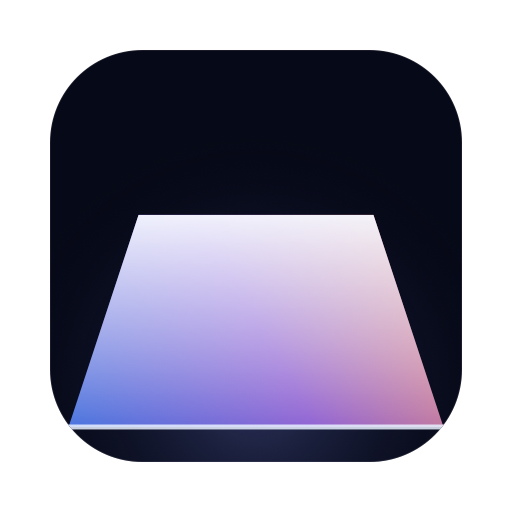
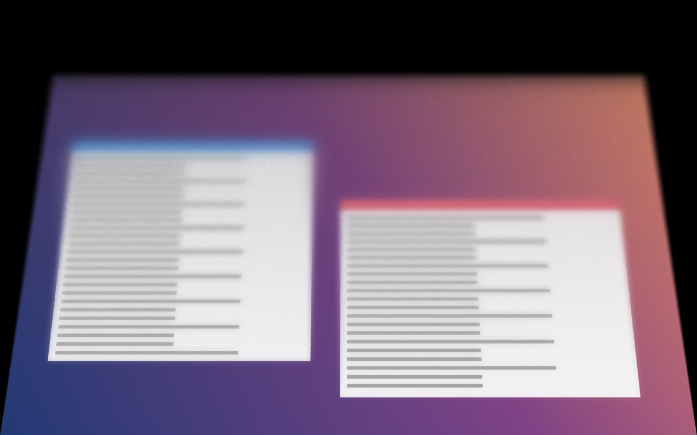
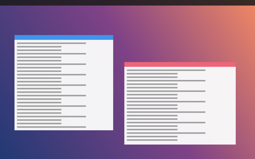
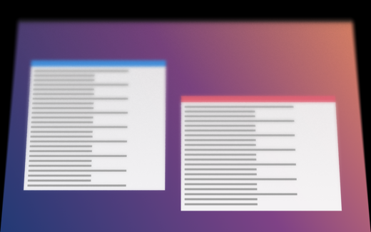
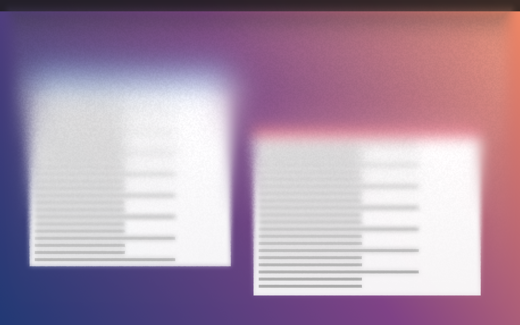

<div align="center">



# FrostFold

**A pane of frosted glass, hinged along the bottom edge of your MacBook's display.**

Close the lid and the picture lifts away with the glass — clear where it still<br>
touches, frosted where it has lifted. It reads the lid-angle sensor directly, so it<br>
moves at the speed of your hand. Stop halfway and it holds there.

<p>
  
  
  
  
  
</p>



<sub>Stills are rendered from a synthetic desktop so none of mine ends up in the repo.<br>
Regenerate them from your own screenshot: <code>Scripts/filmstrip.sh --input shot.png --out docs/images</code></sub>

</div>

---

<p align="center">
  <a href="#the-fold">The fold</a> ·
  <a href="#requirements">Requirements</a> ·
  <a href="#install">Install</a> ·
  <a href="#running-it">Running it</a> ·
  <a href="#settings">Settings</a> ·
  <a href="#how-it-works">How it works</a> ·
  <a href="#tools">Tools</a>
</p>

---

FrostFold is a cosmetic effect and nothing else. It runs in the background with
no dock icon and no menu bar item — no account, no licence key, and no network
code of any kind.

## The fold

The pane is hinged along the bottom edge of the display and folds *away* from
you, carrying the picture with it — the way a lid closes, not the way a page
lifts. The hinge stays pinned at full width while everything above it
foreshortens and converges, so the picture collapses toward the hinge line
instead of spreading. Three things follow, and together they are the whole
effect.

**The gap drives the frost.** The glass still meets the display at the hinge and
lifts further away toward its free edge, so the gap is nothing at the bottom and
widest at the top. Frost follows the gap: the bottom of your screen stays clear
while the top goes milky. Hold frosted glass against text and you can read it;
lift it away and you cannot.

**What it lifts off has nothing left to show.** The picture has gone with the
glass, so the display behind the pane blacks out, and the black opens up from
the top as the pane converges.

**It dims as it leans.** Less light reaches you the further the pane tips away,
so the glass darkens along with the gap.

<table>
<tr>
<td width="33%"></td>
<td width="33%"></td>
<td width="33%"></td>
</tr>
<tr>
<td align="center"><strong>100°</strong><br><sub>above the engage angle — nothing<br>renders, capture is off</sub></td>
<td align="center"><strong>50°</strong><br><sub>gathering — converging, the gap<br>just opening at the free edge</sub></td>
<td align="center"><strong>22°</strong><br><sub>collapsed toward the hinge,<br>blacked out above</sub></td>
</tr>
</table>

Look at the bottom edge of any window in the last two: it stays sharp while its
own title bar has dissolved.

## Requirements

| | |
|---|---|
| **OS** | macOS 14 Sonoma or later |
| **Hardware** | A MacBook with a **continuous lid-angle sensor**. Apple silicon Airs (M2 and later) and 14"/16" Pros have one; the M1 Air, the 13" M1 Pro and every desktop Mac do not. |
| **Toolchain** | Xcode Command Line Tools (`xcode-select --install`). Full Xcode is **not** required — the Metal shaders are compiled at runtime. |

Not sure whether your Mac qualifies? Build it and run `--selftest`; it tells you
in one line.

## Install

```sh
git clone <your-fork> && cd FrostFold
Scripts/signing-identity.sh        # once — see the note below
Scripts/bundle.sh --universal      # arm64 + x86_64
cp -R dist/FrostFold.app /Applications/
open -a FrostFold
```

`Scripts/bundle.sh` compiles a release build, assembles the bundle, copies in
the icon and ad-hoc signs it. Drop `--universal` while you're iterating to build
only the native slice — it's roughly ten times quicker.

> [!IMPORTANT]
> **Run `Scripts/signing-identity.sh` once.** An ad-hoc signature has no identity
> of its own, so the requirement macOS records for the Screen Recording grant is
> the code hash itself:
>
> ```
> designated => cdhash H"9ef21410…"
> ```
>
> Every build with changed source gets a new hash, so macOS treats it as a
> different app and asks for the permission again — and every release you ship
> makes your users re-grant too.
>
> The script creates a self-signed certificate, and the requirement becomes:
>
> ```
> designated => identifier "io.github.frostfold" and certificate root = H"8aae…"
> ```
>
> No hash in it, so no rebuild can invalidate it. `bundle.sh` picks the identity
> up automatically and falls back to ad-hoc if it isn't there. Switching to it
> changes the app's identity once, so expect one final prompt.
>
> It lives in its own keychain, not your login keychain — the login keychain
> gates key access behind an interactive dialog that a script can't answer.
> Remove it any time with `security delete-keychain frostfold-signing.keychain`.

> [!IMPORTANT]
> The app isn't notarised by Apple, so the first launch of a copy you didn't
> build yourself needs **right-click → Open** once, or System Settings →
> Privacy & Security → *Open Anyway*. After that it opens normally.

## Running it

FrostFold has no dock icon and no menu bar item — it starts, sits in the
background and waits for the lid. Launching it again doesn't start a second
copy; it opens the settings of the one already running.

```sh
open -a FrostFold                                   # start it, or open settings
dist/FrostFold.app/Contents/MacOS/FrostFold --quit  # stop it
```

`--settings`, `--preview`, `--quit` and `--selftest` all work on the binary
inside the bundle. The settings window carries an Enabled switch, a Preview
button and Quit, so you never need the command line to get back out.

To start it with the Mac, add `FrostFold.app` under System Settings → General →
Login Items.

## Permission

FrostFold needs **Screen Recording**, and it is not optional — the glass is
built out of your live display, so there is nothing to render without it.

macOS asks once, on first launch, with its own prompt. Allow it and FrostFold
carries straight on — and with the signing identity above in place, it won't
ask again on later builds.

If you dismissed that prompt, macOS won't ask a second time — FrostFold will say
so and offer to open Privacy & Security → Screen Recording, where you can switch
it on and start the app again.

The lid-angle sensor itself needs no permission at all.

## Settings

Launch FrostFold again to open them (`open -a FrostFold`). **Preview…** opens a
window with a manual scrubber, so you can dial the effect in without opening and
closing the lid a hundred times.

**Material**

| | |
|---|---|
| **Intensity** | Low / Medium / High. How milky the top edge gets once the fold is fully in. |
| **Perspective** | How hard the pane converges as it folds away, and with it how fast the gap opens. Higher narrows the free edge further and concentrates the milk at the top. |
| **Edge softness** | Fall-off at the pane's free edges. The hinged edge stays pinned to the display and never fades. |
| **Dimming** | How far the glass darkens as the gap opens. |
| **Corner radius** | Rounding on the free corners, in points, so you can match your display's own rounding. The hinged edge runs straight. |

**Motion**

| | |
|---|---|
| **Responsiveness** | Low trails the lid; high tracks it immediately. |
| **Hinge sensitivity** | Where in the lid's travel the fold does its work. Low holds off until the lid is well down and then gathers; high rises the moment the lid moves. |
| **Minimum movement** | Deadband, in degrees. Below this the pane holds still, so a lid parked part-way open doesn't shimmer on sensor noise. |
| **Engages at** | The lid angle at which the fold starts, 85° by default — a little past perpendicular, so normal use never triggers it. Above this angle nothing renders and capture is off. |
| **Maximum fold** | How far the pane lifts off the display once the fold is fully in — which is what sets the gap, and so the frost. |
| **Stationary frame rate** | 15 / 30 / 60 / 90 / 120 FPS. Only applies while the lid is still. |

The fold is normalised over the span from the engage angle down to roughly shut,
so it always completes as the lid closes, whatever you set the engage angle to.

## How it works

**The sensor.** MacBooks expose the hinge as an Apple HID sensor device (`las`,
usage page `0x20`, usage `0x8A`). Two feature reports carry the angle: report 7
is a little-endian `UInt32` in hundredths of a degree, report 1 a `UInt16` in
whole degrees. FrostFold prefers 7 and falls back to 1. It polls at 120 Hz while
the lid is moving and drops to the stationary rate once it settles.

**The capture.** A ScreenCaptureKit stream over the built-in display, with
FrostFold's own windows excluded from the content filter (and marked
`sharingType = .none`) so the pane cannot capture its own output and spiral.
Frames arrive as `IOSurface`-backed pixel buffers and become Metal textures
without a copy.

**The render.** The pane is a real quad in 3D, hinged along `y = -1` and rotated
about that edge, away from the viewer. The vertex shader hands the rasteriser a
`w` of `(D - z) / D` and lets the hardware do the perspective divide, so the
picture stays correct across the whole pane rather than warping the way a 2D
fake does. Folding away rather than toward also keeps `w > 1` everywhere, so the
near plane can never be crossed however hard the perspective is set. Everything
the pane no longer covers is filled black, because the picture left with the
glass.

The gap at any point on the pane is its distance from the hinge times the sine of
the tilt — zero at the hinge by construction, which is why the bottom stays
clear without that having to be tuned. Frost is read straight off it. Rather than
crossfading one blurred copy against the sharp frame, the renderer builds a
four-level blur pyramid (¼, ⅛ and ¹⁄₁₆ resolution, each softer than the last) and
the fragment shader walks it continuously by the local frost. A crossfade reads
as haze sitting on top of a still-sharp picture; walking a pyramid genuinely
defocuses, which is what a diffuser does. Grain is keyed to pane-local
coordinates, so it lives in the material and travels with it.

There is no specular term anywhere in the shader. Etched glass scatters light;
it does not reflect it.

## Battery

Capture runs only while the pane has something to show. Above the resting angle
the stream is torn down entirely and the overlay clears to fully transparent —
what is left is a feature-report read at the stationary rate, which is a few
dozen bytes over the HID transport.

## Privacy

Captured frames go from ScreenCaptureKit to the GPU and nowhere else. Nothing is
written to disk, nothing is sent anywhere, there is no analytics and no network
code of any kind. Settings live in `UserDefaults`.

## Tools

```sh
# Headless diagnostics: Metal, shader compilation, the sensor, the permission.
dist/FrostFold.app/Contents/MacOS/FrostFold --selftest

# Render the pane over a still image at a range of lid angles.
Scripts/filmstrip.sh --input shot.png --out docs/images

# Redraw the app icon and repack Resources/FrostFold.icns.
Scripts/icon.sh

# Create the self-signed code-signing identity (once).
Scripts/signing-identity.sh
```

`filmstrip` produces the images in this README, and it's the quickest way to
judge a shader change without touching the lid. `icon.sh` draws the app icon
from code — `Resources/FrostFold.icns` is committed, so you only need it if you
change the drawing.

<details>
<summary><strong>Project layout</strong></summary>

```
Sources/FrostFold/
  LidAngleSensor.swift   HID feature-report reader, adaptive polling
  ScreenCapturer.swift   ScreenCaptureKit stream → MTLTexture
  Shaders.swift          Metal source, compiled at runtime
  MetalRenderer.swift    reduce → blur → hinged pane
  GlassView.swift        CAMetalLayer view and the click-through overlay window
  EffectController.swift ties it together, decides when anything runs
  Settings.swift         UserDefaults-backed preferences
  SettingsWindow.swift   SwiftUI settings panel
  PreviewWindow.swift    preview with a manual scrubber
  AppDelegate.swift      background lifecycle, second-launch signals
  SelfTest.swift         --selftest
Tools/filmstrip/         still-image renderer
Tools/icon/              draws the app icon
Scripts/                 bundle.sh, filmstrip.sh, icon.sh, signing-identity.sh
```

</details>

## Notes

This is an independent, clean-room implementation of an idea — a lid-angle-driven
frosted fold — written from a description of the behaviour, not from anyone
else's source, assets or branding. It is not affiliated with or derived from any
other application. The name deliberately avoids Apple trademarks; "MacBook" and
"Mac" appear here only as hardware compatibility statements.

## Licence

MIT. See [LICENSE](LICENSE).
